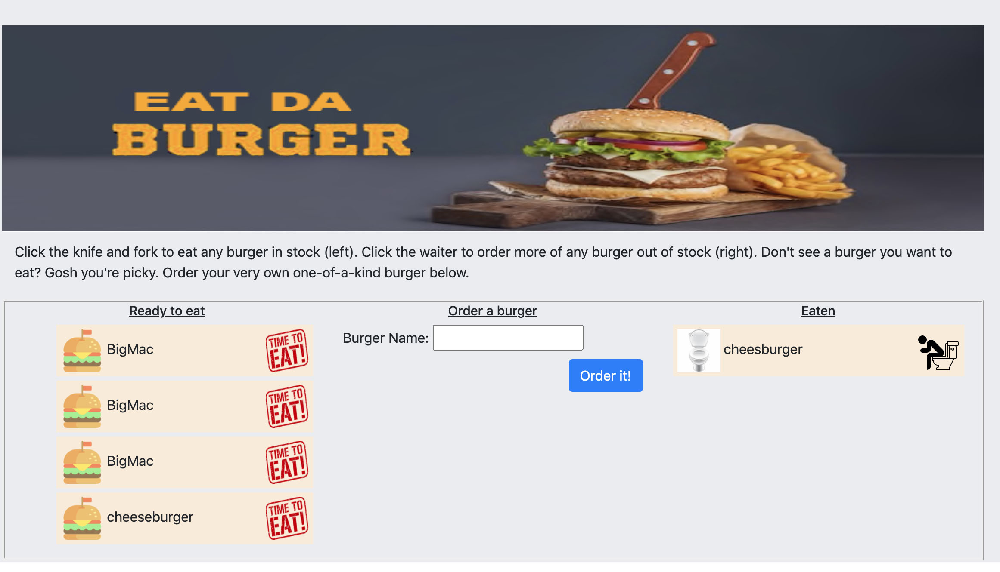

<h1 align="center">Welcome to Unit 13 - Eat Da Burger 👋</h1>

  <p align="center">
  <a href="https://desolate-inlet-67133.herokuapp.com" rel="noopener">
 </a>
</p>


<div align="center">

  [](/issues)
  []()  
  [](/issues)
  []()
  []()
  [](https://opensource.org/licenses/mit-license.php)

</div>

---
A live version of the application can be viewed here : https://desolate-inlet-67133.herokuapp.com/

<p align="center"> The taks was assigned to create a backend node.js application to be deployed to Heroku accessing MYSQL using JAWSDB Mysql.

Eat-Da-Burger! is a restaurant app that lets users input the names of burgers they'd like to eat.

Whenever a user submits a burger's name, your app will display the burger on the left side of the page -- waiting to be devoured.

Each burger in the waiting area also has a Eat it button button. When the user clicks it, the burger will move to the right side of the page. On the right side of the screen the user can "flush" the burger. Sending it away, far away.


This app stores  every burger in a database, whether devoured or not.

In the orm.js file, three methods  will execute the necessary MySQL commands in the controllers. These are the methods needed to use in order to retrieve and store data in your database.

selectAll()
insertOne()
updateOne()

This small demo has been developed to  use Heroku for hosting. Please note that while Heroku is free, it does request credit card information.


 
</p>

## :package: Repositry
[Repositry](https://github.com/ginganinjar/monash-assignment-13)

## 📝 Table of Contents
- [About](#about)
- [Getting Started](#getting_started)
- [Instalation](#deployment)
- [Dependancies](#dependancies)
- [Usage](#usage)
- [License](#license)
- [Authors](#contributing)
- [Acknowledgments](#acknowledgement)
- [Questions](#questions)

## 🧐 Usage <a name = "about"></a>
To provide a full stack MVC application that demonstrates use of both MYSQL, JS and Node.JS development

## 🏁 Getting Started <a name = "getting_started"></a>
These instructions will get you a copy of the project up and running on your local machine for development and testing purposes. See [deployment](#deployment) for notes on how to deploy the project on a live system.

### Installing & 🚀 Deployment <a name = "deployment"></a>

```sh
Clone the repo 

GIT CLONE https://github.com/ginganinjar/monash-assignment-13  from your console.  

Install NPM packages

npm i

NODE server.js

Enviornmental dependances will also need to be placed inside the .ENV file 

  host=localhost
  port=3306
  user=root
  password=Your_password
  database=burgers

 
 - primarily executable : server.js
```
## :heavy_plus_sign: Dependancies  <a name = "dependancies"></a>
{
 
 "dotenv": "^8.2.0",
 
 "express": "^4.17.1",
 
 "express-handlebars": "^3.1.0",
 
 "mysql": "^2.16.0"
}

## :mag: Testing  <a name = "built_using"></a>
echo "Error: no test specified" && exit 1

## ✍️ Authors <a name = "contributing"></a>
David. S

## 🎉 Acknowledgements <a name = "acknowledgement"></a>
The guys at trilogy and Tri

### :copyright: License <a name = "license"></a>

[License](https://opensource.org/licenses/mit-license.php)

## :question: Questions <a name = "<questions"></a>
Questions, concers, comments ? 

Please feel free to contact me at : https://ginganinjar.github.io/contact.html

Looking forward to hearing from you.
